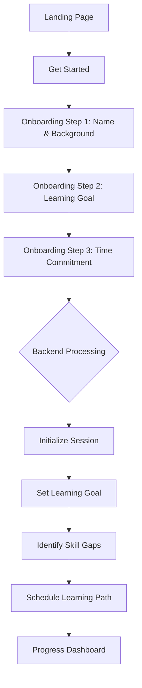
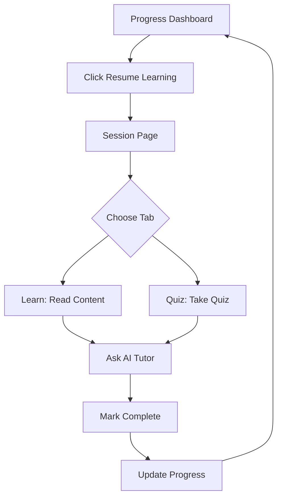

# GenMentor Frontend Documentation

## Table of Contents

1. [Overview](#1-overview)
2. [Architecture](#2-architecture)
3. [Directory Structure](#3-directory-structure)
4. [Tech Stack](#4-tech-stack)
5. [Core Components](#5-core-components)
6. [Pages & Routes](#6-pages--routes)
7. [API Client](#7-api-client)
8. [State Management](#8-state-management)
9. [Styling & Theming](#9-styling--theming)
10. [Hooks](#10-hooks)
11. [Utilities](#11-utilities)
12. [User Flow](#12-user-flow)
13. [Development Guide](#13-development-guide)
14. [Deployment](#14-deployment)

---

## 1. Overview

The GenMentor Frontend is a modern Next.js application that provides an interactive, personalized learning experience. Built with React 19 and Next.js 16, it offers:

- **Modern UI/UX**: Clean, responsive interface with dark mode support
- **AI-Powered Learning**: Interactive sessions with AI tutor chat
- **Progress Tracking**: Visual dashboards showing learning progress
- **Goal-Oriented Paths**: Personalized curriculum based on user goals
- **Real-time Interaction**: Live chat with AI tutor during sessions

### Key Features

| Feature | Description |
|---------|-------------|
| 🎯 Goal Setting | Define and track long-term career objectives |
| 📊 Skill Gap Analysis | Visual representation of current vs. target skills |
| 📚 Learning Path | Structured sessions with progress tracking |
| 🤖 AI Tutor Chat | Context-aware conversational learning assistant |
| 📈 Progress Dashboard | XP system, streaks, badges, and achievements |
| 🌙 Dark Mode | System-aware theme with manual toggle |

---

## 2. Architecture

### 2.1 Application Architecture

```
┌─────────────────────────────────────────────────────────────────────────────┐
│                          GenMentor Frontend                                  │
├─────────────────────────────────────────────────────────────────────────────┤
│                                                                             │
│  ┌─────────────────────────────────────────────────────────────────────┐   │
│  │                         Pages (App Router)                           │   │
│  │  ┌──────────────┐  ┌──────────────┐  ┌──────────────────────────┐  │   │
│  │  │   Landing    │  │  Onboarding  │  │   App (Protected)        │  │   │
│  │  │   /          │  │  /onboarding │  │   /progress, /session/*  │  │   │
│  │  └──────────────┘  └──────────────┘  └──────────────────────────┘  │   │
│  └─────────────────────────────────────────────────────────────────────┘   │
│                                    │                                        │
│  ┌─────────────────────────────────▼───────────────────────────────────┐   │
│  │                         Components Layer                             │   │
│  │  ┌──────────────┐  ┌──────────────┐  ┌──────────────────────────┐  │   │
│  │  │   Layout     │  │   Theme      │  │   Feature Components     │  │   │
│  │  │Sidebar,Topbar│  │Provider,Toggle│  │   AITutorChat            │  │   │
│  │  └──────────────┘  └──────────────┘  └──────────────────────────┘  │   │
│  └─────────────────────────────────────────────────────────────────────┘   │
│                                    │                                        │
│  ┌─────────────────────────────────▼───────────────────────────────────┐   │
│  │                          State Layer                                 │   │
│  │  ┌──────────────────┐  ┌──────────────────┐                        │   │
│  │  │   useSession     │  │   localStorage   │                        │   │
│  │  │   Hook           │  │   Persistence    │                        │   │
│  │  └──────────────────┘  └──────────────────┘                        │   │
│  └─────────────────────────────────────────────────────────────────────┘   │
│                                    │                                        │
│  ┌─────────────────────────────────▼───────────────────────────────────┐   │
│  │                          API Layer                                   │   │
│  │  ┌──────────────────────────────────────────────────────────────┐  │   │
│  │  │                    API Client (api.ts)                        │  │   │
│  │  │     Session, Profile, Goals, Skills, Learning, Chat, etc.     │  │   │
│  │  └──────────────────────────────────────────────────────────────┘  │   │
│  └─────────────────────────────────────────────────────────────────────┘   │
│                                    │                                        │
│  ┌─────────────────────────────────▼───────────────────────────────────┐   │
│  │                       Backend API (FastAPI)                          │   │
│  │                      http://localhost:5000/api/v1                    │   │
│  └─────────────────────────────────────────────────────────────────────┘   │
│                                                                             │
└─────────────────────────────────────────────────────────────────────────────┘
```

### 2.2 Data Flow

```
┌─────────────┐     ┌─────────────┐     ┌─────────────┐     ┌─────────────┐
│   User      │────▶│   Page      │────▶│   API       │────▶│  Backend    │
│   Action    │     │   Component │     │   Client    │     │  Server     │
└─────────────┘     └─────────────┘     └─────────────┘     └─────────────┘
                                                                   │
                                                                   ▼
┌─────────────┐     ┌─────────────┐     ┌─────────────┐     ┌─────────────┐
│   UI        │◀────│   State     │◀────│   Response  │◀────│   Data      │
│   Update    │     │   Update    │     │   Parse     │     │   Process   │
└─────────────┘     └─────────────┘     └─────────────┘     └─────────────┘
```

---

## 3. Directory Structure

```
apps/frontend/
├── public/                        # Static assets
├── src/
│   ├── app/                       # Next.js App Router pages
│   │   ├── layout.tsx             # Root layout (theme, fonts)
│   │   ├── page.tsx               # Landing page (/)
│   │   ├── globals.css            # Global styles & Tailwind
│   │   ├── favicon.ico            # App icon
│   │   │
│   │   ├── login/                 # Login page
│   │   │   └── page.tsx
│   │   │
│   │   ├── onboarding/            # Onboarding wizard
│   │   │   └── page.tsx
│   │   │
│   │   └── (app)/                 # Protected app routes (grouped)
│   │       ├── layout.tsx         # App layout (sidebar, topbar)
│   │       ├── progress/          # Dashboard/Progress page
│   │       │   └── page.tsx
│   │       ├── learning-path/     # Learning path view
│   │       │   └── page.tsx
│   │       ├── skill-gap/         # Skill gap analysis
│   │       │   └── page.tsx
│   │       ├── goals/             # Career goals management
│   │       │   └── page.tsx
│   │       ├── profile/           # User profile & settings
│   │       │   └── page.tsx
│   │       └── session/           # Learning sessions
│   │           └── [id]/          # Dynamic session route
│   │               └── page.tsx
│   │
│   ├── components/                # React components
│   │   ├── layout/                # Layout components
│   │   │   ├── Sidebar.tsx        # Navigation sidebar
│   │   │   └── Topbar.tsx         # Top navigation bar
│   │   ├── ThemeProvider.tsx      # Theme context provider
│   │   ├── ThemeToggle.tsx        # Dark/light mode toggle
│   │   └── AITutorChat.tsx        # AI tutor chat widget
│   │
│   └── lib/                       # Utilities & API
│       ├── api.ts                 # API client & types
│       ├── utils.ts               # Utility functions (cn)
│       └── hooks/                 # Custom React hooks
│           └── useSession.ts      # Session management hook
│
├── .env                           # Environment variables
├── package.json                   # Dependencies & scripts
├── next.config.ts                 # Next.js configuration
├── tailwind.config.ts             # Tailwind CSS config
├── tsconfig.json                  # TypeScript config
└── postcss.config.mjs             # PostCSS config
```

---

## 4. Tech Stack

### 4.1 Core Dependencies

| Package | Version | Purpose |
|---------|---------|---------|
| `next` | 16.1.6 | React framework with App Router |
| `react` | 19.2.3 | UI library |
| `react-dom` | 19.2.3 | React DOM renderer |
| `typescript` | 5.x | Type safety |

### 4.2 UI & Styling

| Package | Version | Purpose |
|---------|---------|---------|
| `tailwindcss` | 4.x | Utility-first CSS |
| `tailwindcss-animate` | 1.0.7 | Animation utilities |
| `clsx` | 2.1.1 | Conditional classnames |
| `tailwind-merge` | 3.5.0 | Merge Tailwind classes |
| `framer-motion` | 12.34.3 | Animation library |
| `lucide-react` | 0.575.0 | Icon library |
| `next-themes` | 0.4.6 | Theme management |

### 4.3 Data & Content

| Package | Version | Purpose |
|---------|---------|---------|
| `react-markdown` | 10.1.0 | Markdown rendering |
| `remark-gfm` | 4.0.1 | GitHub-flavored markdown |
| `recharts` | 3.7.0 | Chart library |
| `sonner` | 2.0.7 | Toast notifications |

### 4.4 Scripts

```json
{
  "dev": "next dev",
  "build": "next build",
  "start": "next start",
  "lint": "eslint"
}
```

---

## 5. Core Components

### 5.1 Layout Components

#### Sidebar

**File**: `components/layout/Sidebar.tsx`

```tsx
"use client";

import Link from "next/link";
import { usePathname } from "next/navigation";
import { BarChart2, Map, Target, User, BookOpen, Activity } from "lucide-react";

const navItems = [
  { name: "Progress", href: "/progress", icon: BarChart2 },
  { name: "Learning Path", href: "/learning-path", icon: Map },
  { name: "Skill Gap", href: "/skill-gap", icon: Activity },
  { name: "Goals", href: "/goals", icon: Target },
  { name: "Profile", href: "/profile", icon: User },
];

export function Sidebar() {
  const pathname = usePathname();

  return (
    <div className="flex h-full w-64 flex-col border-r border-border bg-card px-4 py-6">
      <nav className="flex flex-1 flex-col gap-1">
        {navItems.map((item) => {
          const isActive = pathname === item.href;
          return (
            <Link
              key={item.name}
              href={item.href}
              className={cn(
                "flex items-center gap-3 rounded-lg px-3 py-2.5 text-sm font-medium transition-colors",
                isActive
                  ? "bg-primary-50 dark:bg-primary-950/30 text-primary-700 dark:text-primary-400"
                  : "text-muted-foreground hover:bg-muted hover:text-foreground"
              )}
            >
              <item.icon size={18} />
              {item.name}
            </Link>
          );
        })}
      </nav>
      {/* Progress indicator */}
    </div>
  );
}
```

**Features**:
- Active route highlighting
- Icon-based navigation
- Progress indicator in footer
- Responsive design

#### Topbar

**File**: `components/layout/Topbar.tsx`

```tsx
export function Topbar() {
  return (
    <header className="flex h-16 items-center justify-between border-b border-border bg-card px-8">
      {/* Logo & Brand */}
      <div className="flex items-center gap-3">
        <div className="flex h-8 w-8 items-center justify-center rounded-lg bg-primary-500 text-white">
          <BookOpen size={18} strokeWidth={2.5} />
        </div>
        <span className="text-xl font-bold text-foreground tracking-tight">GenMentor</span>
      </div>

      {/* Actions */}
      <div className="flex items-center gap-4">
        <ThemeToggle />
        <button className="relative rounded-full p-2 text-muted-foreground hover:bg-muted transition-colors">
          <Bell size={18} />
          <span className="absolute right-1.5 top-1.5 h-2 w-2 rounded-full bg-red-500 ring-2 ring-card" />
        </button>
        <Link href="/profile" className="flex h-8 w-8 items-center justify-center rounded-full bg-primary-100 dark:bg-primary-900/50 text-primary-700 dark:text-primary-400">
          <User size={18} />
        </Link>
      </div>
    </header>
  );
}
```

### 5.2 Theme Components

#### ThemeProvider

**File**: `components/ThemeProvider.tsx`

```tsx
"use client";

import * as React from "react";
import { ThemeProvider as NextThemesProvider } from "next-themes";

export function ThemeProvider({ children, ...props }: React.ComponentProps<typeof NextThemesProvider>) {
  return <NextThemesProvider {...props}>{children}</NextThemesProvider>;
}
```

**Usage in Root Layout**:
```tsx
<ThemeProvider
  attribute="class"
  defaultTheme="system"
  enableSystem
  disableTransitionOnChange
>
  {children}
</ThemeProvider>
```

#### ThemeToggle

**File**: `components/ThemeToggle.tsx`

```tsx
export function ThemeToggle({ variant = "default" }: ThemeToggleProps) {
  const { setTheme, resolvedTheme } = useTheme();
  const [mounted, setMounted] = React.useState(false);

  React.useEffect(() => {
    setMounted(true);
  }, []);

  if (!mounted) {
    return <div className="h-9 w-9 rounded-full bg-muted animate-pulse" />;
  }

  const toggleTheme = () => {
    setTheme(resolvedTheme === "dark" ? "light" : "dark");
  };

  // Two variants: "default" for dashboard, "landing" for public pages
  return (
    <button onClick={toggleTheme} className={...}>
      {resolvedTheme === "dark" ? <Moon size={18} /> : <Sun size={18} />}
    </button>
  );
}
```

### 5.3 Feature Components

#### AITutorChat

**File**: `components/AITutorChat.tsx`

```tsx
export default function AITutorChat({ sessionId }: { sessionId: string }) {
  const [messages, setMessages] = useState<Message[]>([
    { id: "1", role: "assistant", content: "Hi! I'm your AI Tutor. How can I help you with this session?" },
  ]);
  const [input, setInput] = useState("");
  const [isLoading, setIsLoading] = useState(false);

  const handleSubmit = async (e: React.FormEvent) => {
    e.preventDefault();
    if (!input.trim() || isLoading) return;

    // Add user message
    const userMessage: Message = { id: Date.now().toString(), role: "user", content: input.trim() };
    setMessages((prev) => [...prev, userMessage]);
    setInput("");
    setIsLoading(true);

    // Call API
    const response = await fetch(`${API_BASE_URL}/chat/chat-with-tutor`, {
      method: "POST",
      headers: { "Content-Type": "application/json" },
      body: JSON.stringify({ session_id: sessionId, message: userMessage.content }),
    });

    const data = await response.json();
    const assistantMessage: Message = { id: (Date.now() + 1).toString(), role: "assistant", content: data.response };
    setMessages((prev) => [...prev, assistantMessage]);
    setIsLoading(false);
  };

  return (
    <div className="w-80 border-l border-border bg-card flex flex-col shrink-0 h-full">
      {/* Header */}
      <div className="p-4 border-b border-border flex items-center gap-3 bg-muted/30">
        <div className="w-8 h-8 rounded-full bg-primary-500/10 text-primary-500">
          <Bot size={18} />
        </div>
        <div>
          <h3 className="font-semibold text-foreground text-sm">AI Tutor</h3>
          <p className="text-xs text-muted-foreground">Always here to help</p>
        </div>
      </div>

      {/* Messages */}
      <div className="flex-1 overflow-y-auto p-4 space-y-4">
        {messages.map((msg) => (
          <div key={msg.id} className={`flex flex-col ${msg.role === "user" ? "items-end" : "items-start"}`}>
            <div className={`max-w-[90%] rounded-2xl p-3 text-sm ${...}`}>
              {msg.role === "assistant" ? (
                <ReactMarkdown remarkPlugins={[remarkGfm]}>{msg.content}</ReactMarkdown>
              ) : (
                msg.content
              )}
            </div>
          </div>
        ))}
        {isLoading && <div>Thinking...</div>}
      </div>

      {/* Input */}
      <form onSubmit={handleSubmit} className="p-4 border-t border-border">
        <input value={input} onChange={(e) => setInput(e.target.value)} placeholder="Ask a question..." />
        <button type="submit" disabled={isLoading || !input.trim()}>
          <ArrowRight size={18} />
        </button>
      </form>
    </div>
  );
}
```

**Features**:
- Real-time chat with AI tutor
- Markdown rendering for responses
- Auto-scroll to latest message
- Loading states
- Session context awareness

---

## 6. Pages & Routes

### 6.1 Route Structure

```
/                           → Landing Page (public)
/login                      → Login Page (public)
/onboarding                 → Onboarding Wizard (public)
/(app)/progress             → Dashboard/Progress (protected)
/(app)/learning-path        → Learning Path View (protected)
/(app)/skill-gap            → Skill Gap Analysis (protected)
/(app)/goals                → Career Goals (protected)
/(app)/profile              → User Profile (protected)
/(app)/session/[id]         → Learning Session (protected)
```

### 6.2 Landing Page

**Route**: `/`
**File**: `app/page.tsx`

```tsx
export default function LandingPage() {
  return (
    <div className="min-h-screen bg-slate-50 dark:bg-slate-950">
      {/* Navigation */}
      <nav className="fixed top-0 w-full bg-white/80 dark:bg-slate-900/80 backdrop-blur-md border-b">
        <Link href="/onboarding" className="bg-primary-500 text-white px-4 py-2 rounded-full">
          Get Started
        </Link>
      </nav>

      {/* Hero Section */}
      <main className="pt-32 pb-16">
        <h1>Master any skill with your <span className="text-primary-500">personal AI mentor</span></h1>
        <p>GenMentor analyzes your goals, identifies your skill gaps, and generates a personalized curriculum.</p>
        <Link href="/onboarding">Start Learning Locally</Link>
      </main>

      {/* Features Section */}
      <section id="features">
        {/* Goal-Oriented Paths, Interactive Sessions, Skill Gap Analysis */}
      </section>
    </div>
  );
}
```

### 6.3 Onboarding Page

**Route**: `/onboarding`
**File**: `app/onboarding/page.tsx`

**3-Step Wizard**:

| Step | Title | Fields |
|------|-------|--------|
| 1 | What's your name? | Name, Background |
| 2 | What is your learning goal? | Learning Goal (textarea) |
| 3 | Time commitment? | Commitment Level (radio) |

**Flow**:
```tsx
export default function OnboardingPage() {
  const [step, setStep] = useState(1);
  const [formData, setFormData] = useState({
    name: "",
    goal: "",
    background: "",
    commitment: "5-10 hours/week",
  });

  const handleNext = async () => {
    if (step < 3) {
      setStep(step + 1);
    } else {
      // Step 1: Initialize session
      const { learner_id } = await api.initializeSession({ name: formData.name });
      setStoredLearnerId(learner_id);

      // Step 2: Set learning goal
      await api.setLearningGoal(learner_id, formData.goal);

      // Step 3: Identify skill gaps
      await api.identifySkillGap({
        learning_goal: formData.goal,
        learner_information: formData.background,
      });

      // Step 4: Generate learning path
      await api.scheduleLearningPath({
        learner_profile: { learner_id },
        session_count: 12,
      });

      router.push("/progress");
    }
  };

  return (
    <div className="min-h-screen flex flex-col items-center justify-center">
      {/* Step Indicator */}
      {/* Form Content */}
      {/* Navigation Buttons */}
    </div>
  );
}
```

### 6.4 Progress Page (Dashboard)

**Route**: `/(app)/progress`
**File**: `app/(app)/progress/page.tsx`

**Sections**:
- **Welcome Header**: Name, streak, level, XP progress
- **Top Stats**: Goal Readiness, XP Earned, Current Streak, Badges
- **Daily Quests**: Gamified daily tasks with XP rewards
- **Next Best Action**: Highlighted CTA for next session
- **Recent Badges**: Achievement icons
- **Career Path Progress**: Milestone timeline

**Key Components**:
```tsx
// Stats Cards with Animations
<motion.div 
  initial={{ opacity: 0, y: 20 }}
  animate={{ opacity: 1, y: 0 }}
  transition={{ delay: i * 0.1 }}
>
  <stat.icon size={24} />
  <p className="text-2xl font-black">{stat.value}</p>
</motion.div>

// Progress Bar
<div className="h-1.5 flex-1 rounded-full bg-secondary overflow-hidden">
  <motion.div 
    initial={{ width: 0 }}
    animate={{ width: "65%" }}
    className="h-full bg-gradient-to-r from-primary-500 to-blue-500" 
  />
</div>
```

### 6.5 Learning Path Page

**Route**: `/(app)/learning-path`
**File**: `app/(app)/learning-path/page.tsx`

**Features**:
- Week-by-week session organization
- Timeline visualization with status icons
- Session status: completed, in-progress, locked
- LocalStorage integration for persistence

```tsx
useEffect(() => {
  const pathData = JSON.parse(localStorage.getItem('learning_path') || '[]');
  if (pathData && Array.isArray(pathData)) {
    setSessions(pathData.map((s: any, idx: number) => ({
      id: idx + 1,
      title: s.session_title || `Session ${idx + 1}`,
      duration: s.estimated_duration || "45 min",
      status: idx === 0 ? "in-progress" : (idx < 2 ? "completed" : "locked"),
      week: Math.floor(idx / 3) + 1,
    })));
  }
}, []);
```

### 6.6 Skill Gap Page

**Route**: `/(app)/skill-gap`
**File**: `app/(app)/skill-gap/page.tsx`

**Layout**:
- Skills to Learn: Current vs. target progress bars
- Mastered Skills: Completed skills list
- Sidebar: Why this matters, Estimated timeline

**Progress Visualization**:
```tsx
<div className="relative h-3 w-full bg-secondary rounded-full overflow-hidden">
  {/* Target Marker */}
  <div className="absolute top-0 bottom-0 w-1 bg-foreground/20 z-10" style={{ left: `${skill.target}%` }} />
  {/* Current Progress */}
  <div className="absolute top-0 bottom-0 bg-gradient-to-r from-primary-500 to-blue-500 rounded-full" style={{ width: `${skill.current}%` }} />
</div>
```

### 6.7 Goals Page

**Route**: `/(app)/goals`
**File**: `app/(app)/goals/page.tsx`

**Features**:
- Goal cards with progress tracking
- Active goal selection
- Goal detail sidebar with milestones
- Add new goal modal

### 6.8 Profile Page

**Route**: `/(app)/profile`
**File**: `app/(app)/profile/page.tsx`

**Sections**:
- Profile Card: Avatar, name, stats
- Quick Stats: Total time, longest streak, skills in progress
- Account Settings: Email, password, notifications
- Danger Zone: Logout, delete account

### 6.9 Session Page

**Route**: `/(app)/session/[id]`
**File**: `app/(app)/session/[id]/page.tsx`

**Layout**:
```
┌─────────────────────────────────────────────────────────────────┐
│ Header: Back button, Session title, Tab switcher, Mark Complete │
├─────────────────────────────────────────────────────────────────┤
│                                                                 │
│  Learning Content / Quiz                    │   AI Tutor Chat  │
│  - Document with code examples              │   - Messages     │
│  - Explain Simpler / Take Quiz buttons      │   - Input        │
│                                                                 │
└─────────────────────────────────────────────────────────────────┘
```

**Tabs**:
- **Learn**: Document content with code examples
- **Quiz**: Interactive quiz questions

```tsx
export default function SessionPage({ params }: { params: { id: string } }) {
  const [activeTab, setActiveTab] = useState("learn");

  return (
    <div className="h-[calc(100vh-4rem)] flex flex-col -m-8">
      <header>
        <div className="flex bg-muted p-1 rounded-lg">
          <button onClick={() => setActiveTab("learn")} className={activeTab === "learn" ? "bg-card" : ""}>Learn</button>
          <button onClick={() => setActiveTab("quiz")} className={activeTab === "quiz" ? "bg-card" : ""}>Quiz</button>
        </div>
      </header>

      <div className="flex-1 flex overflow-hidden">
        <div className="flex-1 overflow-y-auto p-8">
          {activeTab === "learn" ? <LearnContent /> : <QuizContent />}
        </div>
        <AITutorChat sessionId={params.id} />
      </div>
    </div>
  );
}
```

---

## 7. API Client

### 7.1 Configuration

**File**: `lib/api.ts`

```ts
// Use Next.js API proxy for client-side requests to avoid CORS issues
const API_BASE_URL = typeof window !== 'undefined' 
  ? '/api'  // Client-side: use proxy
  : (process.env.NEXT_PUBLIC_API_URL || 'http://localhost:5000/api/v1');  // Server-side

async function fetchApi<T>(endpoint: string, options: RequestInit = {}): Promise<T> {
  const response = await fetch(`${API_BASE_URL}${endpoint}`, {
    ...options,
    headers: {
      'Content-Type': 'application/json',
      ...options.headers,
    },
  });

  if (!response.ok) {
    const error = await response.json().catch(() => ({ detail: 'An error occurred' }));
    throw new Error(error.detail || response.statusText);
  }

  return response.json();
}
```

### 7.2 Type Definitions

```ts
export interface LearnerProfile {
  learner_id: string;
  name: string;
  email?: string;
  learning_goal?: string;
  refined_goal?: any;
  progress_percent?: number;
  last_session_completed?: number;
  created_at: string;
  updated_at?: string;
  metadata?: Record<string, any>;
}

export interface DashboardData {
  success: boolean;
  message: string;
  learner: LearnerProfile & {
    progress: number;
    total_sessions: number;
    completed_sessions: number;
  };
  current_session?: {
    session_number: number;
    topic: string;
    status: string;
    duration_estimate: string;
  };
  learning_path?: {
    sessions: Array<{
      session_number: number;
      topic: string;
      completed: boolean;
      quiz_score?: number;
      duration_estimate?: string;
    }>;
  };
  recent_activity: Array<{
    type: string;
    content: string;
    timestamp: string;
  }>;
  mastery: Record<string, number>;
}

export interface BaseRequest {
  model_provider?: string;
  model_name?: string;
}
```

### 7.3 API Methods

```ts
export const api = {
  // Session Management
  initializeSession: (data: { name?: string; email?: string; metadata?: Record<string, any> }) =>
    fetchApi<{ success: boolean; learner_id: string; profile: LearnerProfile }>('/profile/initialize-session', {
      method: 'POST',
      body: JSON.stringify(data),
    }),

  getProfile: (learnerId: string) =>
    fetchApi<{ success: boolean; learner_profile: LearnerProfile }>(`/profile/get-profile`, {
      method: 'POST',
      body: JSON.stringify({ learner_id: learnerId }),
    }),

  setLearningGoal: (learnerId: string, learningGoal: string, modelProvider?: string, modelName?: string) =>
    fetchApi<{ success: boolean; refined_goal: any; rationale?: string; }>(`/profile/set-goal`, {
      method: 'POST',
      body: JSON.stringify({ learner_id: learnerId, learning_goal: learningGoal, model_provider: modelProvider, model_name: modelName }),
    }),

  // Dashboard
  getDashboard: (learnerId: string) =>
    fetchApi<DashboardData>(`/dashboard`, {
      method: 'POST',
      body: JSON.stringify({ learner_id: learnerId }),
    }),

  // Goals & Skills
  refineGoal: (data: { learning_goal: string; learner_information?: string } & BaseRequest) =>
    fetchApi<{ success: boolean; refined_goal: any; rationale: string; }>('/goals/refine-learning-goal', {
      method: 'POST',
      body: JSON.stringify(data),
    }),

  identifySkillGap: (data: { learning_goal: string; learner_information: string; skill_requirements?: string; } & BaseRequest) =>
    fetchApi<{ success: boolean; skill_requirements: any; skill_gaps: any; learning_goal: string; }>('/skills/identify-skill-gap-with-info', {
      method: 'POST',
      body: JSON.stringify(data),
    }),

  // Learning Path
  scheduleLearningPath: (data: { learner_profile: string | Record<string, any>; session_count: number; } & BaseRequest) =>
    fetchApi<{ success: boolean; learning_path: any; session_count: number; }>('/schedule-learning-path', {
      method: 'POST',
      body: JSON.stringify({ ...data, learner_profile: typeof data.learner_profile === 'string' ? data.learner_profile : JSON.stringify(data.learner_profile) }),
    }),

  rescheduleLearningPath: (data: { learner_profile: string | Record<string, any>; learning_path: string | Record<string, any>; session_count: number; other_feedback?: string | Record<string, any>; } & BaseRequest) =>
    fetchApi<{ success: boolean; learning_path: any; session_count: number; }>('/reschedule-learning-path', {
      method: 'POST',
      body: JSON.stringify({ ...data }),
    }),

  // Content Generation
  exploreKnowledgePoints: (data: { learner_profile: string | Record<string, any>; learning_path: string | Record<string, any>; learning_session: string | Record<string, any>; } & BaseRequest) =>
    fetchApi<{ success: boolean; knowledge_points: any; }>('/learning/explore-knowledge-points', {
      method: 'POST',
      body: JSON.stringify({ ...data }),
    }),

  generateTailoredContent: (data: { learner_profile: string | Record<string, any>; learning_path: string | Record<string, any>; learning_session: string | Record<string, any>; with_quiz?: boolean; use_search?: boolean; allow_parallel?: boolean; } & BaseRequest) =>
    fetchApi<{ success: boolean; tailored_content: any; }>('/learning/tailor-knowledge-content', {
      method: 'POST',
      body: JSON.stringify({ ...data }),
    }),

  // Progress Tracking
  completeSession: (learnerId: string, sessionNumber: number, quizScore?: number, durationMinutes?: number) =>
    fetchApi<{ success: boolean; message: string; session_number: number; next_session?: any; progress_percent: number; }>(`/progress/session-complete`, {
      method: 'POST',
      body: JSON.stringify({ learner_id: learnerId, session_number: sessionNumber, quiz_score: quizScore, duration_minutes: durationMinutes }),
    }),

  // Chat
  chatWithTutor: (data: { messages: string | Array<{ role: string; content: string }>; learner_profile?: string | Record<string, any>; } & BaseRequest) =>
    fetchApi<{ success: boolean; response: string }>('/chat/chat-with-tutor', {
      method: 'POST',
      body: JSON.stringify({ ...data, messages: typeof data.messages === 'string' ? data.messages : JSON.stringify(data.messages) }),
    }),

  // Assessment
  generateDocumentQuizzes: (data: { learning_document: string | Record<string, any>; quiz_count?: number; } & BaseRequest) =>
    fetchApi<{ success: boolean; quizzes: any; }>('/assessment/generate-document-quizzes', {
      method: 'POST',
      body: JSON.stringify({ ...data }),
    }),

  // Models & Config
  listModels: () =>
    fetchApi<{ models: Array<{ model_name: string; model_provider: string }> }>('/list-llm-models'),

  getStorageInfo: () =>
    fetchApi<{ workspace_dir: string; memory_available: boolean; learner_count: number; }>('/storage-info'),

  healthCheck: () =>
    fetchApi<{ status: string; version: string; memory_enabled: boolean; }>('/health'),
};
```

### 7.4 Helper Functions

```ts
/**
 * Helper to get learner_id from localStorage.
 */
export function getStoredLearnerId(): string | null {
  if (typeof window === 'undefined') return null;
  return localStorage.getItem('gen_mentor_learner_id');
}

/**
 * Helper to set learner_id in localStorage.
 */
export function setStoredLearnerId(learnerId: string): void {
  if (typeof window === 'undefined') return;
  localStorage.setItem('gen_mentor_learner_id', learnerId);
}

/**
 * Helper to clear learner_id from localStorage.
 */
export function clearStoredLearnerId(): void {
  if (typeof window === 'undefined') return;
  localStorage.removeItem('gen_mentor_learner_id');
}
```

---

## 8. State Management

### 8.1 Local Storage Keys

| Key | Type | Description |
|-----|------|-------------|
| `gen_mentor_learner_id` | `string` | Unique learner identifier |
| `learner_profile` | `JSON` | Learner profile data |
| `learning_path` | `JSON` | Scheduled learning path |
| `skill_gap` | `JSON` | Skill gap analysis results |
| `current_session` | `JSON` | Current session data |

### 8.2 Session Hook

**File**: `lib/hooks/useSession.ts`

```tsx
interface UseSessionReturn {
  learnerId: string | null;
  profile: LearnerProfile | null;
  isLoading: boolean;
  error: string | null;
  isAuthenticated: boolean;
  initializeSession: (name?: string, email?: string) => Promise<string>;
  refreshProfile: () => Promise<void>;
  clearSession: () => void;
}

export function useSession(): UseSessionReturn {
  const [learnerId, setLearnerId] = useState<string | null>(null);
  const [profile, setProfile] = useState<LearnerProfile | null>(null);
  const [isLoading, setIsLoading] = useState(true);
  const [error, setError] = useState<string | null>(null);

  // Initialize or restore session on mount
  useEffect(() => {
    const initSession = async () => {
      try {
        const savedId = getStoredLearnerId();
        if (savedId) {
          // Verify with backend
          const { learner_profile } = await api.getProfile(savedId);
          setLearnerId(savedId);
          setProfile(learner_profile);
        }
      } catch (err) {
        // Profile not found on backend, clear local storage
        clearStoredLearnerId();
        setLearnerId(null);
        setProfile(null);
      } finally {
        setIsLoading(false);
      }
    };
    initSession();
  }, []);

  // Initialize new session
  const initializeSession = useCallback(async (name?: string, email?: string): Promise<string> => {
    setIsLoading(true);
    const { learner_id, profile: newProfile } = await api.initializeSession({
      name: name || 'Anonymous Learner',
      email,
    });
    setStoredLearnerId(learner_id);
    setLearnerId(learner_id);
    setProfile(newProfile);
    return learner_id;
  }, []);

  // Refresh profile from backend
  const refreshProfile = useCallback(async () => {
    if (!learnerId) return;
    const { learner_profile } = await api.getProfile(learnerId);
    setProfile(learner_profile);
  }, [learnerId]);

  // Clear session
  const clearSession = useCallback(() => {
    clearStoredLearnerId();
    setLearnerId(null);
    setProfile(null);
    setError(null);
  }, []);

  return {
    learnerId,
    profile,
    isLoading,
    error,
    isAuthenticated: !!learnerId,
    initializeSession,
    refreshProfile,
    clearSession,
  };
}
```

**Usage Example**:
```tsx
function MyComponent() {
  const { learnerId, profile, initializeSession, isLoading } = useSession();

  if (isLoading) return <div>Loading...</div>;

  if (!learnerId) {
    return <button onClick={() => initializeSession('John')}>Start</button>;
  }

  return <div>Welcome, {profile?.name}!</div>;
}
```

---

## 9. Styling & Theming

### 9.1 Tailwind Configuration

**File**: `app/globals.css`

```css
@import "tailwindcss";
@plugin "tailwindcss-animate";

@custom-variant dark (&:where(.dark, .dark *));

@theme {
  /* Primary Color Palette */
  --color-primary-50: #e6f8f5;
  --color-primary-100: #c0eee6;
  --color-primary-200: #8ae0d2;
  --color-primary-300: #4dcdba;
  --color-primary-400: #20b4a1;
  --color-primary-500: #02b899;  /* Main brand color */
  --color-primary-600: #00937b;
  --color-primary-700: #007664;
  --color-primary-800: #005d4f;
  --color-primary-900: #004d42;
  --color-primary-950: #002b26;

  /* Semantic Variables */
  --color-background: var(--background);
  --color-foreground: var(--foreground);
  --color-card: var(--card);
  --color-card-foreground: var(--card-foreground);
  --color-muted: var(--muted);
  --color-muted-foreground: var(--muted-foreground);
  --color-border: var(--border);
  --color-input: var(--input);
  --color-ring: var(--ring);
}
```

### 9.2 Light Mode Variables

```css
:root {
  --background: oklch(1 0 0);           /* White */
  --foreground: oklch(0.145 0 0);       /* Near black */
  --card: oklch(1 0 0);                 /* White */
  --card-foreground: oklch(0.145 0 0);  /* Near black */
  --muted: oklch(0.97 0 0);             /* Light gray */
  --muted-foreground: oklch(0.556 0 0); /* Medium gray */
  --border: oklch(0.922 0 0);           /* Light border */
  --primary: oklch(0.205 0 0);          /* Black */
  --primary-foreground: oklch(0.985 0 0); /* White */
}
```

### 9.3 Dark Mode Variables

```css
.dark {
  --background: oklch(0.145 0 0);       /* Dark gray */
  --foreground: oklch(0.985 0 0);       /* White */
  --card: oklch(0.205 0 0);             /* Darker gray */
  --card-foreground: oklch(0.985 0 0);  /* White */
  --muted: oklch(0.269 0 0);            /* Dark muted */
  --muted-foreground: oklch(0.708 0 0); /* Light gray */
  --border: oklch(1 0 0 / 10%);         /* Subtle border */
  --primary: oklch(0.922 0 0);          /* White */
  --primary-foreground: oklch(0.205 0 0); /* Dark */
}
```

### 9.4 Utility Functions

**File**: `lib/utils.ts`

```ts
import { type ClassValue, clsx } from "clsx";
import { twMerge } from "tailwind-merge";

export function cn(...inputs: ClassValue[]) {
  return twMerge(clsx(inputs));
}
```

**Usage**:
```tsx
<div className={cn(
  "base-class",
  isActive && "active-class",
  isDisabled && "disabled-class"
)}>
```

### 9.5 Animation Classes

Using `framer-motion`:
```tsx
<motion.div 
  initial={{ opacity: 0, y: 20 }}
  animate={{ opacity: 1, y: 0 }}
  transition={{ delay: 0.1, duration: 0.5 }}
>
```

Using Tailwind:
```tsx
<div className="animate-in fade-in slide-in-from-bottom-4 duration-500">
```

---

## 10. Hooks

### 10.1 useSession

**Purpose**: Manage learner session state with backend synchronization

**Returns**:
| Property | Type | Description |
|----------|------|-------------|
| `learnerId` | `string \| null` | Current learner ID |
| `profile` | `LearnerProfile \| null` | Learner profile from backend |
| `isLoading` | `boolean` | Loading state |
| `error` | `string \| null` | Error state |
| `isAuthenticated` | `boolean` | Whether user has active session |
| `initializeSession` | `function` | Initialize new session |
| `refreshProfile` | `function` | Refresh profile from backend |
| `clearSession` | `function` | Clear session and logout |

---

## 11. Utilities

### 11.1 cn (Classname Utility)

```ts
import { clsx, type ClassValue } from "clsx";
import { twMerge } from "tailwind-merge";

export function cn(...inputs: ClassValue[]) {
  return twMerge(clsx(inputs));
}
```

**Purpose**: Merge Tailwind classes with conditional logic, handling conflicts properly.

---

## 12. User Flow

### 12.1 Onboarding Flow



### 12.2 Learning Session Flow



---

## 13. Development Guide

### 13.1 Getting Started

```bash
# Install dependencies
cd apps/frontend
npm install

# Start development server
npm run dev

# Open http://localhost:3000
```

### 13.2 Environment Variables

Create `.env` file:
```env
NEXT_PUBLIC_API_URL=http://localhost:5000/api/v1
```

### 13.3 Adding a New Page

1. **Create Page File**:
```tsx
// src/app/(app)/new-page/page.tsx
"use client";

export default function NewPage() {
  return (
    <div className="max-w-6xl mx-auto space-y-8">
      <h1 className="text-3xl font-bold">New Page</h1>
    </div>
  );
}
```

2. **Add to Sidebar** (if protected route):
```tsx
// src/components/layout/Sidebar.tsx
const navItems = [
  // ... existing items
  { name: "New Page", href: "/new-page", icon: NewIcon },
];
```

### 13.4 Adding a New API Method

```tsx
// src/lib/api.ts
export const api = {
  // ... existing methods

  newMethod: (data: SomeType) =>
    fetchApi<ResponseType>('/new-endpoint', {
      method: 'POST',
      body: JSON.stringify(data),
    }),
};
```

### 13.5 Code Style

- **"use client"**: Add to client components
- **TypeScript**: Use strict typing for all props and data
- **Styling**: Use Tailwind utility classes with `cn()` for conditionals
- **Icons**: Use `lucide-react` icon library
- **Animations**: Use `framer-motion` for complex animations

---

## 14. Deployment

### 14.1 Build for Production

```bash
# Build the application
npm run build

# Start production server
npm run start
```

### 14.2 Docker Deployment

```dockerfile
FROM node:20-alpine

WORKDIR /app

COPY package*.json ./
RUN npm ci --only=production

COPY . .
RUN npm run build

EXPOSE 3000

CMD ["npm", "run", "start"]
```

### 14.3 Vercel Deployment

```bash
# Install Vercel CLI
npm i -g vercel

# Deploy
vercel
```

### 14.4 Environment Configuration

| Variable | Required | Description |
|----------|----------|-------------|
| `NEXT_PUBLIC_API_URL` | Yes | Backend API URL |

---

## Appendix A: Component Reference

| Component | Location | Purpose |
|-----------|----------|---------|
| `ThemeProvider` | `components/ThemeProvider.tsx` | Theme context wrapper |
| `ThemeToggle` | `components/ThemeToggle.tsx` | Dark/light mode toggle |
| `Sidebar` | `components/layout/Sidebar.tsx` | Navigation sidebar |
| `Topbar` | `components/layout/Topbar.tsx` | Top navigation bar |
| `AITutorChat` | `components/AITutorChat.tsx` | AI tutor chat widget |

---

## Appendix B: Page Reference

| Page | Route | Description |
|------|-------|-------------|
| Landing | `/` | Public landing page |
| Login | `/login` | Login page |
| Onboarding | `/onboarding` | 3-step wizard |
| Progress | `/progress` | Dashboard with stats |
| Learning Path | `/learning-path` | Session timeline |
| Skill Gap | `/skill-gap` | Skill analysis |
| Goals | `/goals` | Career goals |
| Profile | `/profile` | User settings |
| Session | `/session/[id]` | Learning session |

---

## Appendix C: API Endpoint Reference

| Method | Endpoint | Description |
|--------|----------|-------------|
| POST | `/profile/initialize-session` | Initialize new session |
| POST | `/profile/get-profile` | Get learner profile |
| POST | `/profile/set-goal` | Set learning goal |
| POST | `/dashboard` | Get dashboard data |
| POST | `/goals/refine-learning-goal` | Refine goal |
| POST | `/skills/identify-skill-gap-with-info` | Identify skill gaps |
| POST | `/schedule-learning-path` | Schedule path |
| POST | `/reschedule-learning-path` | Reschedule path |
| POST | `/learning/explore-knowledge-points` | Explore knowledge |
| POST | `/learning/tailor-knowledge-content` | Generate content |
| POST | `/progress/session-complete` | Mark session complete |
| POST | `/chat/chat-with-tutor` | Chat with AI tutor |
| POST | `/assessment/generate-document-quizzes` | Generate quizzes |
| GET | `/list-llm-models` | List LLM models |
| GET | `/storage-info` | Storage info |
| GET | `/health` | Health check |

---

*Documentation generated: 2026-02-23*
*GenMentor Frontend Version: 0.1.0*
